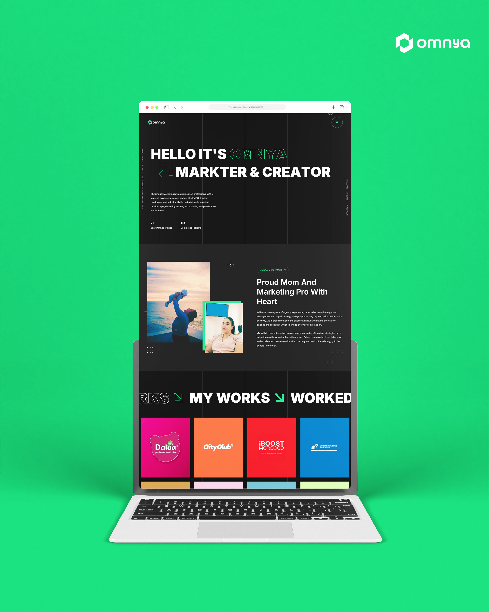

## 🌟 Omnya's Portfolio

  Welcome to Omnya Bouhamed portfolio! This project showcases her work as a multilingual marketing & communication professional with 7+ years of experience across various industries, including FMCG, tourism, healthcare, and industry. You'll find details of the completed projects, experience, and testimonials from clients.
  
---



---

💻 **Live Demo:** [www.omnya-two.vercel.app](https://omnya-two.vercel.app/)

---

### 🔥 Key Features:
- **Responsive Design:** Optimized for all devices, ensuring a smooth user experience on mobile, tablet, and desktop.
- **Smooth Animations:** Powered by `GSAP` and `ScrollTrigger`, enhancing the interactivity and fluidity of the site.
- **Dynamic Content:** Fetches data dynamically using `Contentful` for blog posts and other content.
- **Multilingual Support:** Supports English and French, reflecting my international work experience.

### ⚙️ Technologies Used:
- **Next.js** - React-based framework for static and dynamic site generation.
- **TypeScript** - For better code quality and type safety.
- **GSAP** - Used for creating high-performance animations.
- **Contentful** - CMS for managing and delivering dynamic content.
- **SCSS** - For modular and reusable styling.
- **CSS Modules** - Ensures scoped CSS and prevents class name conflicts.
- **Node.js** - For server-side operations and building APIs.

---

### 🚀 Getting Started:

1. **Clone the repository:**
   ```bash
   git clone https://github.com/yourusername/yourportfolio.git
   ```

2. **Install dependencies:**
   ```bash
   npm install
   ```

3. **Run the development server:**
   ```bash
   npm run dev
   ```

4. **Build for production:**
   ```bash
   npm run build
   ```

5. **Deploy to production:**
   Follow your hosting provider’s guidelines (e.g., Vercel, Netlify, etc.).

---

### 🎨 Design & Mockup:

```markdown

---

### 👩‍💻 Author:
**Abdeljalil Rajli**  
Feel free to reach out at [rajlicontact@gmail.com](mailto:rajli.contact@gmail.com) for inquiries or collaboration opportunities.

---
